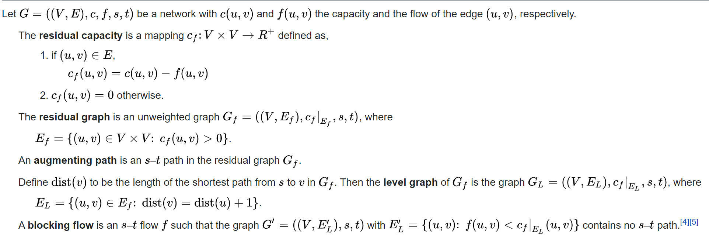

### 1. The Approach.

This is a rather straight forward example of a 
[maximum flow problem](https://en.wikipedia.org/wiki/Maximum_flow_problem). So it can be formulated like this:

Given a graph which represents a flow network where every edge has a capacity. Also given two vertices source s and sink
t in the graph, find the maximum possible flow from s to t with following constraints:

* Flow on an edge does not exceed the given capacity of the edge.
* Incoming flow is equal to outgoing flow for every vertex except s and t.

An initial assumption would probably be to use the 
[Edmonds-Karp algorithm](https://en.wikipedia.org/wiki/Edmonds%E2%80%93Karp_algorithm) 
with a time complexity of O(VE**2). In this
solution, I would instead go for the 
[Dinic’s algorithm](https://en.wikipedia.org/wiki/Dinic%27s_algorithm) 
which is a faster one taking O(EV**2).

Like Edmond Karp’s algorithm, Dinic’s algorithm uses following concepts:

* A flow is maximum if there is no s to t path in a residual graph.
* BFS is used in a loop. There is a difference though in the way we use BFS in both algorithms.

In Edmond’s Karp algorithm, we use BFS to find an augmenting path and send flow across this path. In Dinic’s algorithm,
we use BFS to check if more flow is possible and to construct level graph. In level graph, we assign levels to all
nodes, level of a node is the shortest distance (in terms of number of edges) of the node from source. Once level graph
is constructed, we send multiple flows using this level graph. This is the reason it works better than Edmond Karp. In
Edmond Karp, we send only flow that is sent across the path found by BFS.

#### Formal Definition

### 2. What kind of running time we should expect here.

Time Complexity is O(EV**2). It is a 
[strongly polynomial](https://en.wikipedia.org/wiki/Time_complexity#Strongly_and_weakly_polynomial_time) 
algorithm. The runtime does not depend on the capacity values of the flow graph.

* Doing a BFS to construct level graph takes O(E) time.
* Sending multiple more flows until a blocking flow is reached takes O(VE) time.

The total running time for each layer is then O(E+ VE) = O(VE). The outer loop runs at-most O(V) time, constructing a
new level graph and finding a blocking flow. Therefore, the overall time complexity is O(EV**2).

### 3. The first viable solution.

The main idea of the algorithm is to guid augmenting paths from the source to the sink using a level graph.

1. Construct a level graph by doing a BFS from the source to label all the levels of the current flow graph.
1. If the sink was never reached while building the level graph, then stop and return the max flow.
1. Using only valid edges in the level graph, do multiple DFSs from s -> t until a BLOCKING FLOW is reached, and sum
   over the bottleneck values of all the augmenting paths found to calculate the max flow.
1. Repeat steps 1 to 3.

A flow is Blocking Flow if no more flow can be sent using level graph, i.e., no more s-t path exists such that path
vertices have current levels 0, 1, 2… in order. Blocking Flow can be seen same as maximum flow path in Greedy
algorithms.

### 4. Optimizing for runtime.

If we use adjacency list instead of the adjacency matrix, we can effectively prune all the dead ends in a level graph,
thus slightly reducing the running time. Also, when optimized with 
[dynamic trees (link/cut trees)](https://en.wikipedia.org/wiki/Link/cut_tree) 
the algorithm can converge in O(ElogV).
